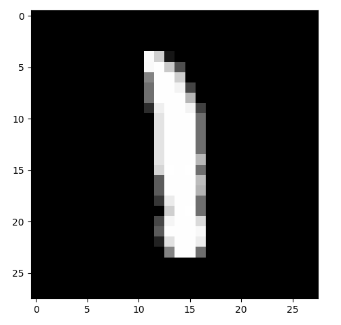

# 画像認識 課題1

---

## 1. 課題内容

MNIST の画像 1 枚を入力とし，3層ニューラルネットワークを用いて，0～9 の値のうち
1つを出力するプログラムを作成せよ．

---

## 2. 作成したプログラムについて

作成したプログラムのファイルは`my_nn_test.py`である。

はじめに、`NNTest`というクラスを作成した。`NNTest`クラスの中身は以下の コード1 のようになっている。

```Python
class NNTest:
    """ Class of Neural Network (testing).

    Attributes:
        network: data and parameters in NN.

    """
    d = 28 * 28
    img_div = 255
    c = 10
    m = 200
    batch_size = 1
    X, Y = mndata.load_testing()
    X = np.array(X)
    X = X.reshape((X.shape[0], 28, 28))
    Y = np.array(Y)

    def __init__(self):
        np.random.seed(3304)
        # for Exercise 1
        self.network = {}
        w1_tmp = np.random.normal(0, math.sqrt(1 / self.d), self.m * self.d)
        self.network['w1'] = w1_tmp.reshape((self.m, self.d))
        w2_tmp = np.random.normal(0, math.sqrt(1 / self.m), self.c * self.m)
        self.network['w2'] = w2_tmp.reshape((self.c, self.m))
        b1_tmp = np.random.normal(0, math.sqrt(1 / self.d), self.m)
        self.network['b1'] = b1_tmp.reshape((self.m, 1))
        b2_tmp = np.random.normal(0, math.sqrt(1 / self.m), self.c)
        self.network['b2'] = b2_tmp.reshape((self.c, 1))
```
<center><small>コード1 NNTest クラスのソースコード</small></center><br>

クラス変数については以下のように設定してある。

- `d` ... 画像の次元
- `img_div` ... 画素値を正規化するための変数。今回は白黒画像で画素値の範囲が 0~255 であるため、255 に設定してある。
- `c` ... クラス数。今回は 0~9の数字の識別を行うため、10 に設定してある。
- `m` ... 中間層のノード数。
- `batch_size` ... バッチサイズ。課題1では入力する画像の枚数は 1 であるので今回は 1 に設定してある。
- `X, Y` ... MNIST テストデータ。X には画像、Y には正解ラベルが格納される。

インスタンス変数については以下のように設定してある。

- `network` ... パラメータを格納するディクショナリ。課題1では重みのパラメータ`w1`,`w2`,`b1`,`b2`を格納している。

---

次に`main()`部分についての説明を行う。`main()`のソースコードは以下の コード2 の通りである。

```Python
def main():
    """
    This is the main function.
    """

    nn = NNTest()

    while True:
        print("input an integer from 0 to 9999.")
        idx = int(sys.stdin.readline(), 10)
        if 0 <= idx < 10000:
            break
        else:
            print("invalid input ;-(")

    # forwarding
    forward_data = forward(nn, idx)
    y = np.argmax(forward_data['y'], axis=0)

    # -- for showing images --
    plt.imshow(nn.X[idx], cmap=cm.gray)
    print("Recognition result -> {0} \n Correct answer -> {1}".format(y, nn.Y[idx]))
    plt.show()
```
<center><small>コード2 main 関数部</small></center><br>

`main()`内では主に以下のことを行なっている。

1. `NNTest` クラスインスタンスの作成
2. 標準入力から整数を入力
3. 順伝播を行う
4. 認識結果と正解ラベル、および画像の表示

3 の順伝播については `forward(nn, idx)`部分が該当する。
`forward()`について中身を詳細に説明する。
`forward()`内は以下の コード3 のようになっている。

```Python
def forward(nn: NNTest, idx: int):
    """ Forwarding

    Args:
        nn: Class NNTest
        idx: input from standard input

    Returns:
        Dictionary data including the calculation result in each layer.

    """
    data_forward = {}

    # input_layer : (1, batch_size * d) -> (d = 784, batch_size)
    output_input_layer = input_layer(nn.X[idx], nn)
    # mid_layer : (d = 784, batch_size) -> (m, batch_size)
    a_mid_layer = affine_transformation(nn.network['w1'], output_input_layer, nn.network['b1'])
    z_mid_layer = mid_layer_activation(a_mid_layer)
    # output_layer : (m, batch_size) -> (c = 10, batch_size)
    a_output_layer = affine_transformation(nn.network['w2'], z_mid_layer, nn.network['b2'])
    result = output_layer_apply(a_output_layer)

    data_forward['x1'] = output_input_layer
    data_forward['a1'] = a_mid_layer
    data_forward['z1'] = z_mid_layer
    data_forward['a2'] = a_output_layer
    data_forward['y'] = result

    return data_forward
```
<center><small>コード3 forward 関数</small></center><br>

変数名と3層ニューラルネットワークの対応は以下の通りである。

- `output_input_layer` ... 入力層からの出力。784 行 1 列の行列である。画素値は 0~255 の値であるが、ここで正規化を行う。
- `a_mid_layer` ... 中間層でのアフィン変換後の値。`m` 行 1 列の行列である。
- `z_mid_layer` ... `a_mid_layer` に活性化関数（課題 1 ではシグモイド関数）を適用したもの。`m` 行 1 列の行列である。
- `a_output_layer` ... 出力層でのアフィン変換後の値。
- `result` ... `a_output_layer` にソフトマックス関数を適用したもの。

中間層、出力層においてアフィン変換を適用する関数`affine_transformation()`、中間層においてシグモイド関数を適用する関数`mid_layer_activation()`、シグモイド関数`f_sigmoid()`、出力層においてソフトマックス関数を適用する関数`output_layer_apply()`、ソフトマックス関数`f_softmax()`の実装については、非常に単純な実装となっているため説明を割愛する。

`forward()` において返り値は`data_forward`となっている。
`data_forward` はディクショナリ型であり、各層での計算結果が格納されている。課題 1 では出力層における計算結果 `result` を格納した `data_forward['y']` しか用いないが、のちに Back propagation を実装するため、このような実装とした。

---

## 3. 実行結果

`my_nn_test.py` を実行し、標準入力から`777`と入力したところ、以下の 実行結果1 のようになった。

```zsh
input an integer from 0 to 9999.
777
Recognition result -> [5] 
 Correct answer -> 1

Process finished with exit code 0
```
<center><small>実行結果1 my_nn_test.py</small></center><br>

認識結果が 5、正解ラベルが 1 という結果が標準出力に出力されていることがわかる。また、以下の 図1 の画像が表示された。

<center>

</center>

<center><small>図1 表示された画像</small></center><br>

これにより、正しく動作していることが確認できた。

## 4. 工夫点と問題点

問題点として、整数の入力を標準入力から行うときに int 型でない値を入力したときに例外処理を行なっていないため、プログラムが不正終了してしまう点が挙げられる。