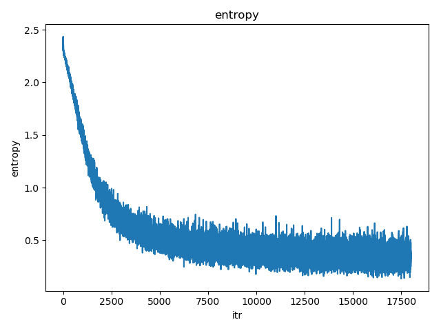

# 画像認識 課題3

---

## 1. 課題内容

[課題2] のコードをベースに，3 層ニューラルネットワークのパラメータを学習するプログラムを作成せよ．

---

## 2. 作成したプログラムについて

作成したプログラムのファイルは`my_nn_learn.py`である。

課題2から追加、変更になった点は以下の通りである。

- Back propagation の追加
- パラメータの更新を行い、パラメータの学習を行う
- クロスエントロピー誤差の平均を記録し、学習過程をグラフに表示
- 学習したパラメータを保存する機能を追加

本レポートでは主に変更点、追加点について詳細に説明する。

はじめに、`main()`部分についての説明を行う。`main()`のソースコードは以下の コード1 の通りである。課題 2 のソースコードに Back propagation を行う部分、1 エポックごとに学習回数とクロスエントロピー誤差の平均をグラフ化したものを出力する部分、学習終了後にパラメータを保存する部分を追加している。

```Python
def main():
    """
    This is the main function.
    """

    nn = NNLearn()
    nums = list(range(0, nn.X.size // nn.d))

    loss = np.array([])
    iteration = np.array([], dtype='int32')

    for itr in p(range(nn.per_epoch * nn.epoch)):
        # init
        input_img = np.array([], dtype='int32')
        t_label = np.array([], dtype='int32')

        # select from training data
        choice_nums = np.random.choice(nums, nn.batch_size, replace=False)

        # data input
        for i in range(nn.batch_size):
            tmp_img = nn.X[choice_nums[i]]
            input_img = np.append(input_img, tmp_img)
            t_label = np.append(t_label, nn.Y[choice_nums[i]])

        nn.network['t_label'] = t_label
        nn.network['t_label_one_hot'] = one_hot_vector(t_label, nn.c)

        # forwarding
        forward_data = forward(nn, input_img)

        # print cross entropy
        # print("average cross entropy -> {0}".format(forward_data['avg_entropy']))

        # back propagation
        back_prop(nn, forward_data)

        iteration = np.append(iteration, itr + 1)
        loss = np.append(loss, forward_data['avg_entropy'])

        if itr % nn.per_epoch == nn.per_epoch - 1:
            plt.plot(iteration, loss)
            plt.title("entropy")
            plt.xlabel("itr")
            plt.ylabel("entropy")
            plt.show()

    # save parameters
    print("パラメータを保存するファイルの名前を ***.npz の形式で入力してください")
    filename = str(sys.stdin.readline())
    filename = filename.replace('\n', '')
    filename = filename.replace('\r', '')
    np.savez(filename, w1=nn.network['w1'], w2=nn.network['w2'], b1=nn.network['b1'],
             b2=nn.network['b2'], loss=loss)
```
<center><small>コード1 main 関数部</small></center><br>

`main()`内では主に以下のことを行なっている。

1. `NNLearn` クラスインスタンスの作成
2. バッチサイズの数だけ学習データからランダムに画像を選ぶ
3. 正解ラベルを one-hot vector 表現に変換する
4. 順伝播を行う
5. Back propagation を行い、パラメータを更新する
6. クロスエントロピー誤差平均を記録する
7. 手順4から6を設定した回数だけ繰り返し、1エポックごとにクロスエントロピー誤差と学習回数の関係を表したグラフを出力する
8. 学習終了後、学習したパラメータを保存する

1~4 については課題2ですでに実装済みである。

6, 7 についてはコード1 の `iteration = np.append ...`から`plt.show()`の部分が該当する。`iteration`は学習回数、`loss`はクロスエントロピー誤差の平均値を配列で記録している。これを1エポックごとに matplotlib を利用して、学習回数とクロスエントロピー誤差の関係をグラフ化する。

5については `back_prop()`に実装を行っている。`back_prop()`のコードについては以下の コード2 のようになっている。

```Python
def back_prop(nn: NNLearn, data: dict):
    """ Back propagation

    Args:
        nn: NNLearn
        data: calculating result in forwarding

    """

    # 1. softmax and cross entropy
    grad_en_ak = (data['y'] - nn.network['t_label_one_hot'].T) / nn.batch_size

    # 2. find grad(E_n, X), grad(E_n, W2), grad(E_n, b2)
    grad_en_x2 = np.dot(nn.network['w2'].T, grad_en_ak)
    grad_en_w2 = np.dot(grad_en_ak, data['z1'].T)
    grad_en_b2 = grad_en_ak.sum(axis=1)
    grad_en_b2 = grad_en_b2.reshape((nn.c, 1))

    # 3. back propagate : sigmoid
    bp_sigmoid = np.dot(nn.network['w2'].T, grad_en_ak) * (1 - f_sigmoid(data['a1'])) * f_sigmoid(data['a1'])

    # 4. find grad(E_n, X), grad(E_n, W1), grad(E_n, b2)
    grad_en_x1 = np.dot(nn.network['w1'].T, bp_sigmoid)
    grad_en_w1 = np.dot(bp_sigmoid, data['x1'].T)
    grad_en_b1 = bp_sigmoid.sum(axis=1)
    grad_en_b1 = grad_en_b1.reshape((nn.m, 1))

    # 5. update parameter
    nn.network['w1'] -= nn.eta * grad_en_w1
    nn.network['w2'] -= nn.eta * grad_en_w2
    nn.network['b1'] -= nn.eta * grad_en_b1
    nn.network['b2'] -= nn.eta * grad_en_b2
```
<center><small>コード2 back_prop 関数</small></center><br>

`grad_en_ak` はソフトマックス関数とクロスエントロピー誤差の逆伝搬を行なっている。

`grad_en_x2`, `grad_en_w2`, `grad_en_b2` はそれぞれ出力層の入力、重み、バイアスの逆伝播を行なっている。

`bp_sigmoid` は、シグモイド関数の逆伝播である。

`grad_en_x1`, `grad_en_w1`, `grad_en_b1` はそれぞれ中間層の入力、重み、バイアスの逆伝播を行なっている。

これらの勾配の計算を行なった後、各勾配に学習率（`nn.eta`）を掛けた値をもとの各パラメータから減算し、パラメータを更新している。

---

## 3. 実行結果

バッチサイズを 100、1エポックあたりの学習回数を 60000 / 100 = 600 回、エポック数を 30、学習係数を 0.01、中間層のノード数を 200として学習を行なった。パラメータの学習が終了したときに得られたグラフを以下の図1に示す。このグラフは横軸が学習回数、縦軸がクロスエントロピー誤差の平均値を表している。

<center></center>

<center><small>図1 学習回数とクロスエントロピー誤差平均</small></center><br>

図1より、学習が進むにつれてクロスエントロピー誤差の平均値が減少していることがわかる。はじめ、クロスエントロピー誤差の平均値がおよそ2.3~2.4付近であることから認識精度が10%程度であり、ランダムに分類しているときとほぼ同程度の認識精度であることがわかる。学習終了後、クロスエントロピー誤差の平均値が0.2~0.3付近になっているため、今回の実装では認識精度はおおよそ 74~80% になっている。

## 4. 工夫点、問題点

別の実装方法として、アフィン変換レイヤー、活性化関数レイヤーなど、各レイヤーをクラス化して、クラス内に順伝播、逆伝播の関数を定義する方法が考えられるが、今回は誤差逆伝播の計算過程を電子版テキストに沿って書くことを考えたため、`back_prop` 関数内で計算をすべて完結させるようにした。

問題点として、学習係数を一定値にしているため、学習の終盤でクロスエントロピー誤差の平均値が大きく振動していることが挙げられる。対処法としては、学習のはじめは学習係数を大きめに設定し、学習が進むごとに徐々に学習係数を小さくしていくことが考えられる。